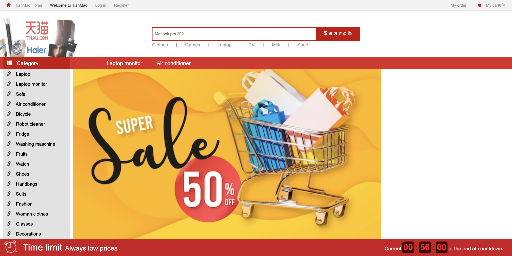
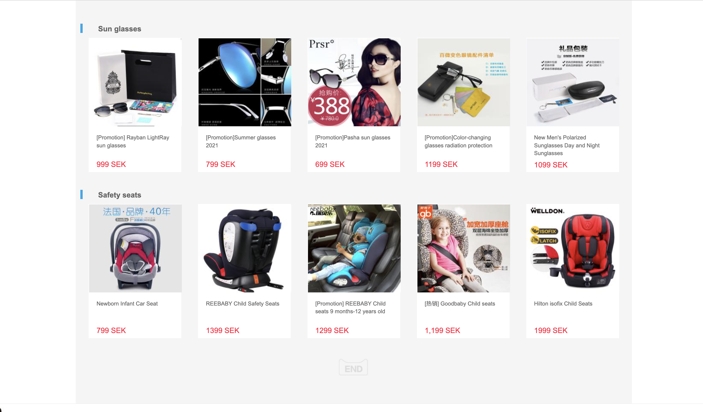

# TianMao
**TianMao** is a website for business-to-consumer (B2C) online retail, spun off from Taobao, operated in China by Alibaba Group.
This is a frontend static exercise that not using frontend framework but ony using HTML and CSS. 

## Features 
- Log in 
- Search box and navigation 
- Header and footer

## Screenshots 
 

 

